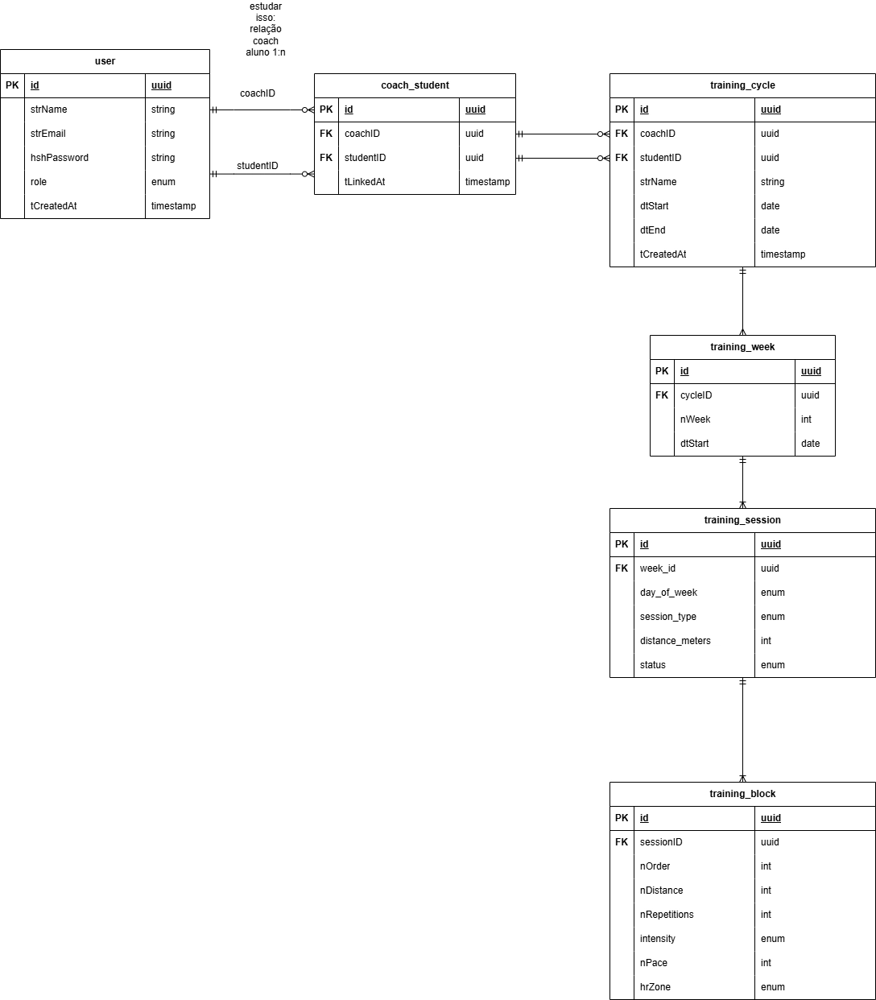
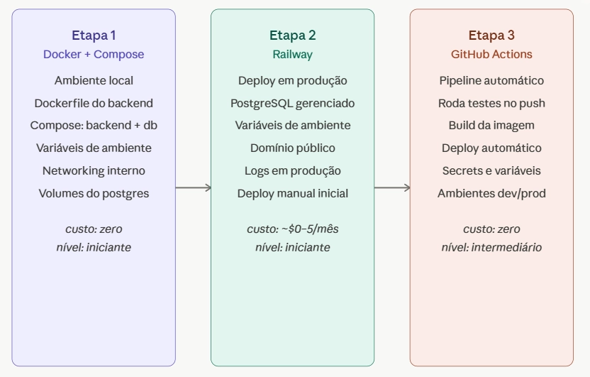

# Track App | Treinamento Inteligente

> Lucas Dias Nardino @ 2026

> O Track App surge com o objetivo de auxiliar a gestão e visualização de planilhas de treinamento de corrida por professores e alunos, permitindo a criação e acompanhamento de ciclos de treino, agenda de treinos e visualização do progresso do aluno.

# Funcionalidades

## Professor

- Definição de modelos de treino
- Criação automática de planilhas de treino para alunos
- Acompanhamento do progresso dos alunos
- Gestão de agenda de treinos

## Aluno

- Visualização de planilhas de treino
- Acompanhamento do progresso individual
- Recebimento de notificações sobre treinos e atualizações

---

# Stack

| Camada | Tecnologia |
| --- | --- |
| Backend | Java 21 + Spring Boot 3 |
| Banco | PostgreSQL + Flyway |
| Autenticação | Spring Security + JWT |
| Frontend | Next.js + TypeScript |
| Infra local | Docker + Docker Compose |
| Deploy | Railway ou Render |
| CI/CD | GitHub Actions |

---

# Arquitetura

## Diagrama de Entidade-Relacionamento (ERD)

## Arquitetura de Deploy

